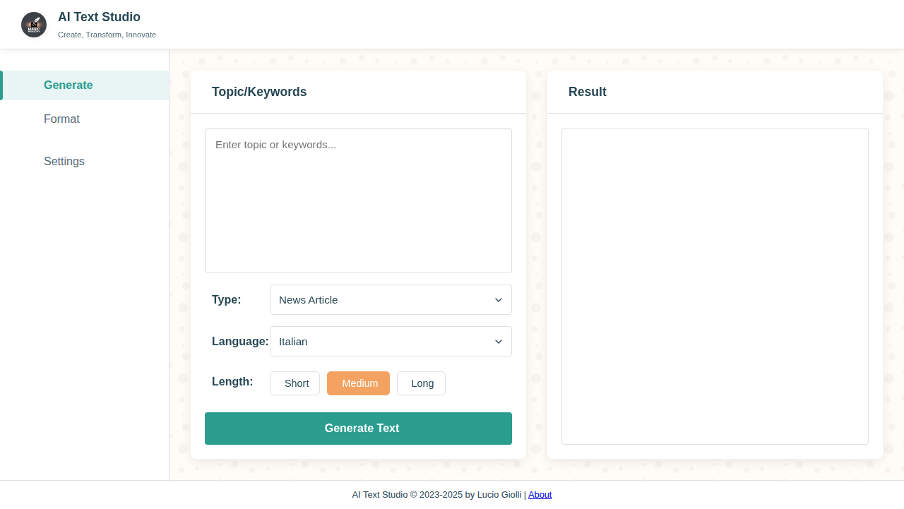

# AI Text Studio



**Create, Transform, Innovate** - A powerful web-based application for generating and formatting text using artificial intelligence.

## 🚀 Features

### Text Generation
- **Multiple Content Types**: Generate news articles, blog posts, essays, diary entries, and short stories
- **Keyword-Based**: Create content based on topics or keywords you provide
- **Multi-Language Support**: Generate content in Italian, English, Spanish, French, German, Portuguese, Chinese, Japanese, Korean, or any custom language
- **Length Control**: Choose between short, medium, or long content lengths

### Text Formatting
- **Style Transformation**: Format existing text into different styles including:
  - Social media posts
  - Professional blog format
  - Minimal/clean formatting
- **Markdown Support**: Automatic markdown formatting for enhanced readability
- **Conversation History**: Maintains context for iterative formatting

### AI Provider Integration
- **Multiple AI Providers**: Support for various AI services:
  - **Mock/Demo Mode**: No API required for testing
  - **Hugging Face**: Access to open-source models
  - **OpenAI**: GPT models integration
  - **Azure OpenAI**: Enterprise-grade OpenAI services
  - **Anthropic Claude**: Advanced conversational AI
  - **GitHub Models**: GitHub's AI model offerings
- **Flexible Configuration**: Easy switching between providers
- **Custom Models**: Support for custom model specifications

### User Experience
- **Dark/Light Theme**: Toggle between themes for comfortable viewing
- **Responsive Design**: Works seamlessly on desktop and mobile devices
- **Export Options**: Copy to clipboard, download as file, or share content
- **Settings Persistence**: Your preferences are saved locally
- **Real-time Processing**: Live text generation and formatting

## 🛠️ Installation & Setup

### Quick Start
1. **Clone the repository**:
   ```bash
   git clone https://github.com/davvoz/ai_text_studio_by_luciogiolli.git
   cd ai_text_studio_by_luciogiolli
   ```

2. **Serve the application**:
   Since this is a client-side application, you can serve it using any static file server:
   
   **Option 1: Python (if you have Python installed)**
   ```bash
   python3 -m http.server 8080
   ```
   
   **Option 2: Node.js (if you have Node.js installed)**
   ```bash
   npx serve .
   ```
   
   **Option 3: PHP (if you have PHP installed)**
   ```bash
   php -S localhost:8080
   ```

3. **Open in browser**: Navigate to `http://localhost:8080`

### Using with AI Providers

#### Demo Mode (No Setup Required)
- Select "Demo Mode (No API)" in the API configuration
- Perfect for testing the interface without API keys

#### Setting Up AI Providers
1. Click the **⚙️ Configure API** button
2. Select your preferred AI provider
3. Enter your API token/key
4. Choose a model (if applicable)
5. Save settings

**Getting API Keys:**
- **Hugging Face**: [Get your token](https://huggingface.co/settings/tokens) (use Inference API token)
- **OpenAI**: [Get your API key](https://platform.openai.com/api-keys)
- **Anthropic**: [Get your key](https://console.anthropic.com/keys)
- **Azure OpenAI**: Configure through Azure portal
- **GitHub Models**: [GitHub personal access token](https://github.com/settings/tokens)

## 📖 Usage

### Generating New Content
1. **Navigate to the Generate tab**
2. **Enter your topic or keywords** in the text area
3. **Select content type** (news article, blog post, essay, etc.)
4. **Choose language** and content length
5. **Click "Generate Text"**
6. **Review and export** your generated content

### Formatting Existing Text
1. **Navigate to the Format tab**
2. **Paste or type your text** in the input area
3. **Select a formatting style** (social, blog, minimal)
4. **Click "Format Text"**
5. **Review the formatted output**

### Tips for Best Results
- **Be specific** with your keywords and topics
- **Use the conversation history** for iterative improvements
- **Experiment with different providers** for varied outputs
- **Adjust length settings** based on your needs

## 🏗️ Technical Architecture

### Frontend Technologies
- **Pure JavaScript ES6+**: Modern JavaScript with module system
- **Responsive CSS**: Mobile-first design approach
- **Font Awesome**: Icon library
- **Google Fonts**: Typography (Poppins, Montserrat)

### Architecture Pattern
- **Modular Design**: Separate services for different functionalities
- **Service Layer**: Dedicated services for generation, formatting, UI control, etc.
- **Provider Pattern**: Pluggable AI provider system
- **Local Storage**: Client-side settings persistence

### Key Components
- **GeneratorService**: Handles text generation logic
- **FormatterService**: Manages text formatting operations
- **LLMGateway**: Unified interface for AI providers
- **UIController**: Manages user interface interactions
- **SettingsManager**: Handles configuration and preferences
- **NotificationService**: User feedback and notifications

## 📁 Project Structure

```
ai_text_studio_by_luciogiolli/
├── index.html              # Main application interface
├── css/                    # Stylesheets
│   ├── styles.css         # Main styles
│   ├── api-config.css     # API configuration styles
│   ├── markdown.css       # Markdown formatting
│   └── ...               # Component-specific styles
├── js/                    # JavaScript modules
│   ├── script.js          # Main application entry point
│   ├── CONFIG.js          # Application configuration
│   ├── GeneratorService.js # Text generation service
│   ├── FormatterService.js # Text formatting service
│   ├── LLMGateway.js      # AI provider gateway
│   ├── providers/         # AI provider implementations
│   └── ...               # Other service modules
├── assets/                # Static assets
│   ├── app_icon.jpeg      # Application icon
│   └── screenshot.png     # Application screenshot
└── README.md              # This file
```

## 🤝 Contributing

Contributions are welcome! Here's how you can help:

1. **Fork the repository**
2. **Create a feature branch**: `git checkout -b feature/amazing-feature`
3. **Make your changes** and test thoroughly
4. **Commit your changes**: `git commit -m 'Add amazing feature'`
5. **Push to the branch**: `git push origin feature/amazing-feature`
6. **Open a Pull Request**

### Development Guidelines
- Follow the existing code style and architecture
- Test your changes with multiple AI providers
- Ensure responsive design compatibility
- Update documentation as needed

## 📜 License

This project is developed by **Lucio Giolli**. 

## 🙏 Acknowledgments

- **Lucio Giolli** - Original developer and creator
- **AI Provider Communities** - For making powerful AI models accessible
- **Open Source Community** - For the tools and libraries that make this possible

## 📞 Support

If you encounter any issues or have questions:

1. **Check the GitHub Issues** for existing solutions
2. **Open a new issue** with detailed information about your problem
3. **Include your browser, AI provider, and error messages** when reporting bugs

---

**AI Text Studio** - Empowering creativity through artificial intelligence ✨